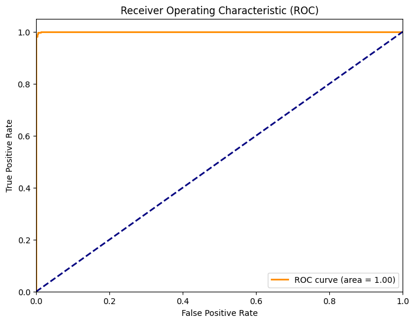

# 😷 Real-Time Face Mask Detection System

A computer vision system that detects whether a person is wearing a face mask in real-time using Deep Learning.

## 🚀 Features
- **Real-Time Detection:** Processes video feed instantly using OpenCV.
- **High Accuracy:** 99% Accuracy and 1.00 AUC Score on test data.
- **Lightweight:** Built on **MobileNetV2** for fast performance on CPUs/Laptops.
- **Robust:** Handles basic lighting changes and movement.

## 🛠️ Tech Stack
- **Language:** Python 3.10+
- **Deep Learning:** TensorFlow / Keras (MobileNetV2)
- **Computer Vision:** OpenCV (Haar Cascades)
- **Data Handling:** NumPy, Sklearn

## 📊 Performance
The model was trained on the "Masked-Face Recognition" dataset and achieved:
- **Accuracy:** 99%
- **F1-Score:** 0.99
- **AUC Score:** 1.00
- **False Positive Rate:** <0.3%
## 📸 Live Demo Results

Here is the system running in real-time on a video feed:

### No Mask Detected (Red Warning)


### Mask Detected (Green Safe)


### Confusion Matrix


### ROC Curve


## 💻 How to RunZ
1. Clone the repository:
   ```bash
   git clone [https://github.com/YOUR_USERNAME/Real-Time-Face-Mask-Detection.git](https://github.com/YOUR_USERNAME/Real-Time-Face-Mask-Detection.git)

<!-- Install dependencies: -->
   pip install tensorflow opencv-python numpy imutils

<!-- Run the application: -->
   python detect_mask_video.py


   Author
Kingsley Buabeng - AI & Machine Learning Engineer

